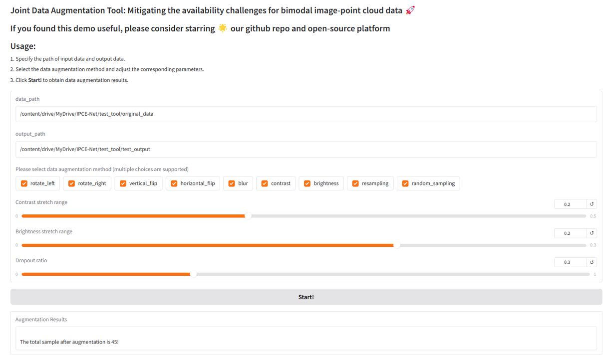

# Joint_Data_Augmentation_Tool

## Abstract
<p align="justify">
We provide a user-friendly tool for joint image-point cloud data augmentation, to address the challenges arising from the scarcity of bimodal data. For the image-point cloud pairs in the datasets, rotation 90° (right and left), horizontal flip, vertical flip, image blurring, brightness adjustment (original brightness ± 20%), contrast enhancement, point cloud resampling and point cloud random dropout, can be employed for data augmentation. 
</p>

We have provided a **Colab** template for quick and easy access to this method. Please click it. [](https://colab.research.google.com/gist/Lijp411/d1f712d232281150fb47572f65e3d985/joint_data_augmentation_tool.ipynb)

<div align="center">
  
</div>

## 🔧 Installation
  ```
  # create and activate the conda environment
  conda create -n Augmentation python=3.10
  conda activate Augmentation

  # install the necessary packages for interactive operation
  pip install gradio
  ```

## 🚀 Data Augmentation
  For the instance annotations in COCO format and point clouds in S3DIS format, you can perform bimodal data augmentation with the following command.
  ```
  python Joint_Data_Augmentation.py
  ```

  Also, you can perform data augmentation for the only image modal data (e.g. instance annotations in COCO format) with the following command.
  ```
  python Data_Augmentation_only_COCO.py
  ```

## 🔦 Interactive Operation on Gradio
  You can use our [example data](https://drive.google.com/drive/folders/1fpuO7Upai8coMN5ZfUDoegk0SRrhCYUe?usp=drive_link) to interactively expande data using the following command.
  ```
  python Joint_Data_Augmentation_Gradio.py
  ```
  After that, you can obtain the results following the usage instructions.
  
  

## 🤝 Contact us
  If you find this repo helpful, please give us a star. For any questions, please contact us via lijp57@mail2.sysu.edu.cn.

## Acknowledgement
-  This work is built upon the excellent [Gradio](https://github.com/gradio-app/gradio).
-  We sincerely thank the [FreeReg](https://github.com/WHU-USI3DV/FreeReg) for readme template.
